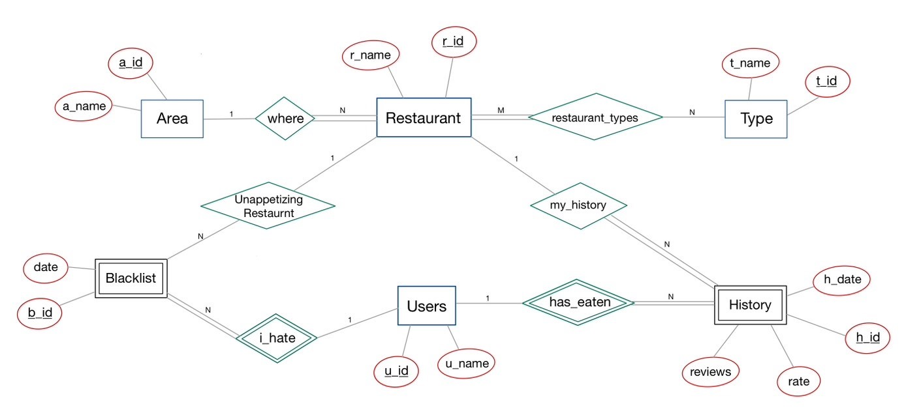
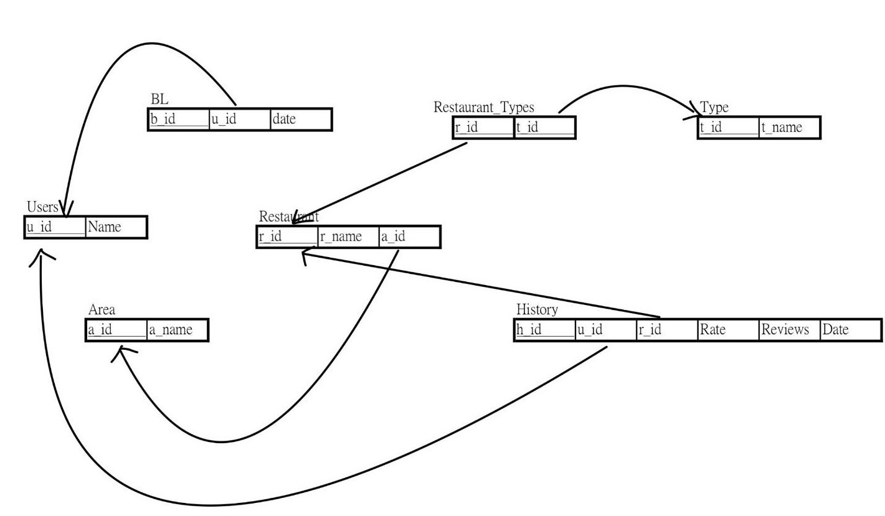

# 政大周邊餐廳隨機選擇系統
## 團隊成員與分工

| 組員         | 學號       | 分工內容              | 貢獻比例 |
|--------------|------------|-----------------------|----------|
| **何嘉柚**   | 111703010  | 歷史紀錄、創建資料庫 | 20%      |
| **葉宇翰**   | 111703016  | 評分系統、黑名單     | 20%      |
| **賴元智（組長）** | 111703043 | 隨機選擇、PPT        | 20%      |
| **吳岱芸**   | 111703047  | CRUD、CSS 美化       | 20%      |
| **吳珮嘉**   | 111703057  | 查詢（分類）、PPT    | 20%      |

---

## 專案簡介
身為政治大學的學生，常常在用餐時間不知道吃什麼。因此，我們設計了一個隨機餐廳推薦系統，幫助用戶快速決定用餐地點。本系統還提供評分、搜尋、黑名單等功能，讓使用者打造屬於自己的美食筆記。

---

## 系統功能
1. **隨機餐廳功能**：
   - 一鍵隨機推薦附近的餐廳。
   - 支援外部連結 Google Maps 。
2. **搜尋餐廳功能**：
   - 輸入關鍵字或選擇分類篩選餐廳。
3. **評分系統功能**：
   - 用戶可對餐廳留下評分與評論。
4. **歷史紀錄功能**：
   - 查看曾經評分過的所有餐廳。
5. **黑名單功能**：
   - 將不喜歡的餐廳加入黑名單，避免再次推薦。

---

## ER-model
以下是本系統使用的 ER 模型，為資料庫設計提供基礎結構。



---
## Relational schema



---
## 系統架構
- **前端**：HTML、CSS、JavaScript
- **後端**：Flask (Python)
- **資料庫**：SQLite

---

## 安裝與使用
1. **環境需求**：
   - Python 3.9+
   - pip

2. **專案下載**：
   ```bash
   git clone [https://github.com/your-repo/random-restaurant-selector.git](https://github.com/shiokko/Database_Final.git)
   cd random-restaurant-selector
